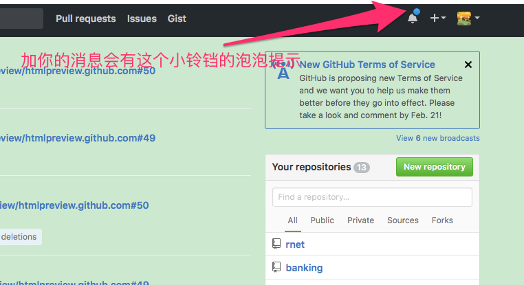
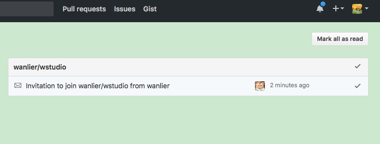
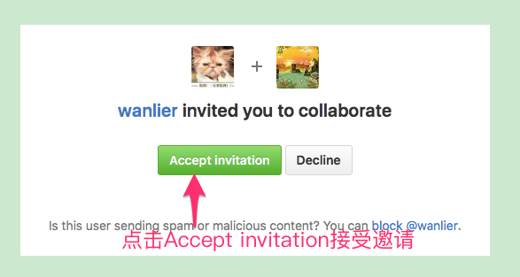
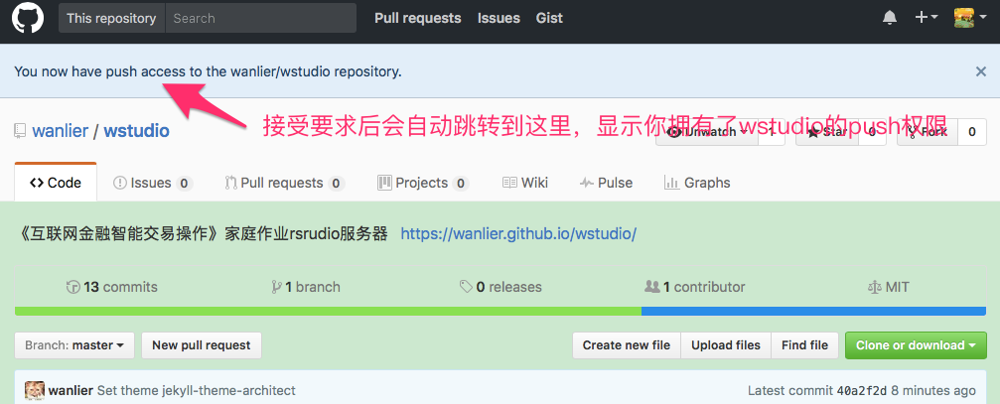
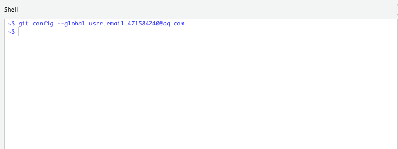
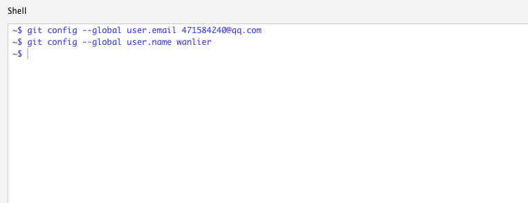

# 互联网金融课程作业区

这里是万里学院《互联网金融智能交易操作》课程的作业区，课程主页见<https://qiufei.github.io/rnet/>

## 一、请大家不要删除除了你自己创建的文件之外的文件

比如，韩梅梅在这里自己创建了hanmeimei1314.Rmd的文件，那么她只能修改文件名为hanmeimei1314的文件，其他文件都不要动。

其他每个同学也一样。

## 二、作业的内容

家庭作业的主要内容是每人选1到5个股票，按照老师的要求，和自己的想法，写一些分析报告。

写好的分析报告上传到作业区的wstudio库中。要有上传内容到wstudio库的权限，首先要称为wstudio库的Collaborators。

## 三、成为wstudio库的Collaborators

为了获得push到作业库中的权限，每个同学必须成为wstudio库的Collaborators。

请大家按照[课程主页](https://qiufei.github.io/rnet/)上说的方法和命名规则注册github账户，我会按照大家的用户名加你们为Collaborators。

### 加你们的消息发出后，你们登陆自己的GitHub主页后会有提示

### 点击那个小铃铛后会看到消息

### 点击消息打开，接受邀请

是的，左边那个帅气的小猫就是作业服务器的头像。

### 接受成功，获取push权限

## 四、git使用

* git是团队协作的工具

* 虽然我们把git当作手动网盘和服务器的通信工具来用

* 但是git的真正价值在于团队协作

### git的基本设置

* git在安装后需要设置邮箱和用户名

* 下面介绍下设置用户名和邮箱的命令，具体怎么使用git来与服务器练通信会在操作课上讲。

### git的邮箱设置

在rstudio的Tools菜单下，点击Shell...，会跳出命令行界面

把上面的QQ邮箱地址换成你自己的邮箱。

### git用户名设置

把上面的wanlier换成你自己在github网站注册的用户名，例如hanmeimei1314

### git的四条基本命令

* git pull

* git add --all

* git commit -a -m "双引号内随便你说什么都可以"

* git push

### 第一条命令git pull

* 从云端库里获得更新

* 我们的家庭作业库是放在github网站上的

* 这条命令就等于是从<https://github.com/wanlier/wstudio>下载最新的全部内容

### 第二条命令git add

* 每个人对自己的Rmd文件作了修改后，要告诉git系统，你确定了这些修改

* 于是通过 git add --all把你做的所有修改告诉git

* 参数--all是所有修改的意思

### 第三条命令git commit

* 是你要执行的git动作

* 前一条命令已经记录了所有的修改，要地这些修改作何处置呢？

* git commit -a -m 的意思是把这饿修改添加到原始的库中去

* 最后的双引号信息也是必须的，这是解释你这条修改的目的是什么。

### 第四条命令 git push

* 前一条命令说了要把修改加到原始库中去

* git push是真正开始数据传输，可以理解为你把数据上传网盘
