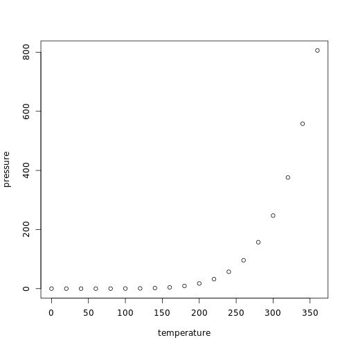

运行日期是2017-03-29。这一行主要是用来检验是否自动运行。

我们知道文字的表现力是有限的，所以需要表格和图片来增强表现力。

## 制作表格

对R自带的数据集cars，用head函数得到其前两行数据，将信息存到变量my_table中，再用knitr宏包中的kable函数来生成表格。


```r
my_table = head(cars,2)
kable(my_table)
```


| speed| dist|
|-----:|----:|
|     4|    2|
|     4|   10|

## 加入图片

然后再画个图，对R自带的pressure数据集，用plot函数来画图。


