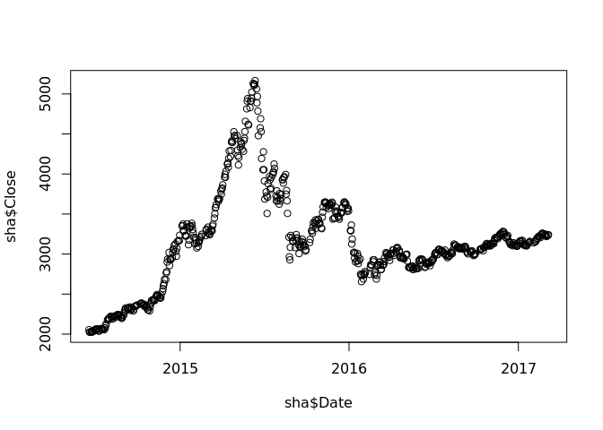
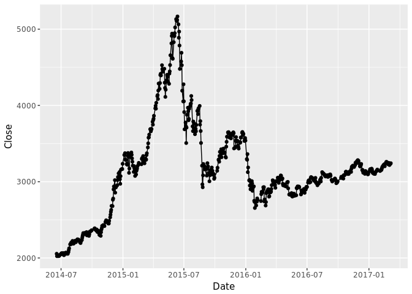

# 我的第一份R作业
邱飞  
3/9/2017  


## 介绍：获取数据

这是我的第一份R语言作业，老师让我们对上证指数做一些简单的分析。

首先，是通过Quandl宏包来获取上证指数数据。

下面的api_key是注册Quandl网站后，网站免费提供的。有了这个代码，可以保证日访问量超过500次。


```r
library(Quandl)
```

```
## Loading required package: xts
```

```
## Loading required package: zoo
```

```
## 
## Attaching package: 'zoo'
```

```
## The following objects are masked from 'package:base':
## 
##     as.Date, as.Date.numeric
```

```r
sha = Quandl("GOOG/SHA_000001", api_key="9iGeZZoG6Vc46rfs1AgJ")
```


## 直观感受：数字

我们获得的上证指数数据已经保存在变量sha中，现在我们对它来做些简单的描述性分析。

### 看看数据的前几行长啥样


```r
# the defualt is to see first 6 rows
head(sha)
```

```
##         Date    Open    High     Low   Close    Volume
## 1 2017-03-07 3233.09 3242.66 3226.82 3242.41 164064235
## 2 2017-03-06 3217.33 3234.66 3215.07 3233.87 156092158
## 3 2017-03-03 3219.20 3221.16 3206.61 3218.31 157082368
## 4 2017-03-02 3250.52 3256.81 3228.66 3230.03 181215076
## 5 2017-03-01 3240.07 3259.98 3237.87 3246.93 190677550
## 6 2017-02-28 3225.97 3242.68 3225.97 3241.73 151244318
```

```r
# if you want see first 10 rows
head(sha,10)
```

```
##          Date    Open    High     Low   Close    Volume
## 1  2017-03-07 3233.09 3242.66 3226.82 3242.41 164064235
## 2  2017-03-06 3217.33 3234.66 3215.07 3233.87 156092158
## 3  2017-03-03 3219.20 3221.16 3206.61 3218.31 157082368
## 4  2017-03-02 3250.52 3256.81 3228.66 3230.03 181215076
## 5  2017-03-01 3240.07 3259.98 3237.87 3246.93 190677550
## 6  2017-02-28 3225.97 3242.68 3225.97 3241.73 151244318
## 7  2017-02-27 3249.19 3251.65 3224.09 3228.66 182581071
## 8  2017-02-24 3246.86 3253.96 3233.53 3253.43 186406362
## 9  2017-02-23 3258.83 3264.08 3236.35 3251.38 209179800
## 10 2017-02-22 3252.69 3261.38 3243.84 3261.22 207453776
```

如果你想让现实的结果好看一点，你可以用knitr宏包来美化一下输出结果。


```r
library(knitr)
simple_head = head(sha)
beautiful_head = kable(simple_head)

beautiful_head
```


Date             Open      High       Low     Close      Volume
-----------  --------  --------  --------  --------  ----------
2017-03-07    3233.09   3242.66   3226.82   3242.41   164064235
2017-03-06    3217.33   3234.66   3215.07   3233.87   156092158
2017-03-03    3219.20   3221.16   3206.61   3218.31   157082368
2017-03-02    3250.52   3256.81   3228.66   3230.03   181215076
2017-03-01    3240.07   3259.98   3237.87   3246.93   190677550
2017-02-28    3225.97   3242.68   3225.97   3241.73   151244318


### 看看数据的结构


```r
str(sha)
```

```
## 'data.frame':	664 obs. of  6 variables:
##  $ Date  : Date, format: "2017-03-07" "2017-03-06" ...
##  $ Open  : num  3233 3217 3219 3251 3240 ...
##  $ High  : num  3243 3235 3221 3257 3260 ...
##  $ Low   : num  3227 3215 3207 3229 3238 ...
##  $ Close : num  3242 3234 3218 3230 3247 ...
##  $ Volume: num  1.64e+08 1.56e+08 1.57e+08 1.81e+08 1.91e+08 ...
##  - attr(*, "freq")= chr "daily"
```

### 看看数据的简单统计


```r
summary(sha)
```

```
##       Date                 Open           High           Low      
##  Min.   :2014-06-18   Min.   :2013   Min.   :2027   Min.   :2011  
##  1st Qu.:2015-02-16   1st Qu.:2881   1st Qu.:2906   1st Qu.:2841  
##  Median :2015-10-27   Median :3096   Median :3122   Median :3077  
##  Mean   :2015-10-24   Mean   :3147   Mean   :3181   Mean   :3115  
##  3rd Qu.:2016-06-29   3rd Qu.:3363   3rd Qu.:3401   3rd Qu.:3323  
##  Max.   :2017-03-07   Max.   :5174   Max.   :5178   Max.   :5103  
##      Close          Volume         
##  Min.   :2024   Min.   : 13538758  
##  1st Qu.:2887   1st Qu.:164030332  
##  Median :3103   Median :216966702  
##  Mean   :3154   Mean   :278623979  
##  3rd Qu.:3373   3rd Qu.:357134384  
##  Max.   :5166   Max.   :857132807
```


## 直观感受：图形

R语言一个强大之处在于它的图形表达能力，但是它的默认的图形输出实在不好看，所以需要我们用各种宏包做下美化。

### 默认图形画图

```r
plot(sha$Date,sha$Close)
```

<!-- -->


### ggplot画图

```r
library(ggplot2)
picture = ggplot(data = sha, aes(x = Date,y = Close))+
                 geom_line()+
                 geom_point()
picture
```

<!-- -->

