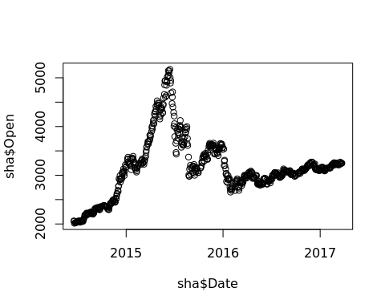
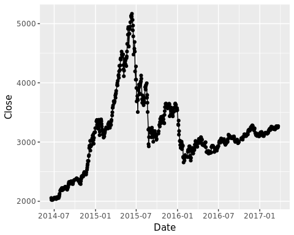

# 我的第一份R作业
邱飞-2016900020  
2017年3月16日  


## 介绍：数据获取

这是我的第一份R语言作业，老师让我们对上证指数做一些简单的分析。

首先，是通过Quandl宏包来获取上证指数数据。

下面的api_key是注册Quandl网站后，网站免费提供的。有了这个代码，可以保证日访问量超过500次。so


```r
library(Quandl)
```

```
## Loading required package: xts
```

```
## Loading required package: zoo
```

```
## 
## Attaching package: 'zoo'
```

```
## The following objects are masked from 'package:base':
## 
##     as.Date, as.Date.numeric
```

```r
sha = Quandl("GOOG/SHA_000001", api_key="9iGeZZoG6Vc46rfs1AgJ")
```


## 直观感受：数字

我们获得的上证指数数据已经保存在变量sha中，现在我们对它来做些简单的描述性分析。

### 看看数据的前几行长啥样

这里是用head函数。


```r
head(sha)
```

```
##         Date    Open    High     Low   Close    Volume
## 1 2017-03-24 3247.35 3275.21 3241.12 3269.45 219777914
## 2 2017-03-23 3245.81 3262.09 3221.93 3248.55 193029144
## 3 2017-03-22 3246.22 3255.78 3229.13 3245.22 189731649
## 4 2017-03-21 3250.25 3262.22 3246.70 3261.61 162719306
## 5 2017-03-20 3241.11 3251.13 3228.12 3250.81 170548430
## 6 2017-03-17 3271.87 3274.19 3232.28 3237.45 200583223
```

### 看数据的结构

这里是用str函数。


```r
str(sha)
```

```
## 'data.frame':	677 obs. of  6 variables:
##  $ Date  : Date, format: "2017-03-24" "2017-03-23" ...
##  $ Open  : num  3247 3246 3246 3250 3241 ...
##  $ High  : num  3275 3262 3256 3262 3251 ...
##  $ Low   : num  3241 3222 3229 3247 3228 ...
##  $ Close : num  3269 3249 3245 3262 3251 ...
##  $ Volume: num  2.20e+08 1.93e+08 1.90e+08 1.63e+08 1.71e+08 ...
##  - attr(*, "freq")= chr "daily"
```

### 看看数据的简单统计

 这里是用summary函数。
 
 

```r
summary(sha)
```

```
##       Date                 Open           High           Low      
##  Min.   :2014-06-18   Min.   :2013   Min.   :2027   Min.   :2011  
##  1st Qu.:2015-02-27   1st Qu.:2887   1st Qu.:2912   1st Qu.:2852  
##  Median :2015-11-05   Median :3104   Median :3126   Median :3084  
##  Mean   :2015-11-03   Mean   :3149   Mean   :3183   Mean   :3117  
##  3rd Qu.:2016-07-13   3rd Qu.:3347   3rd Qu.:3391   3rd Qu.:3303  
##  Max.   :2017-03-24   Max.   :5174   Max.   :5178   Max.   :5103  
##      Close          Volume         
##  Min.   :2024   Min.   : 13538758  
##  1st Qu.:2896   1st Qu.:163733265  
##  Median :3109   Median :215374620  
##  Mean   :3155   Mean   :276590219  
##  3rd Qu.:3353   3rd Qu.:352400438  
##  Max.   :5166   Max.   :857132807
```


## 直观感受：图形

R语言一个强大之处在于它的图形表达能力，但是它的默认的图形输出实在不好看，所以需要我们用各种宏包做下美化。

### 默认图形画图
用plot函数


```r
plot(sha$Date,sha$Open)
```

<!-- -->

## ggplot画图

用的是ggplot2宏包。


```r
library(ggplot2)

picture = ggplot(data = sha, aes(x = Date,y = Close))+
                 geom_line()+
                 geom_point()
picture
```

<!-- -->

